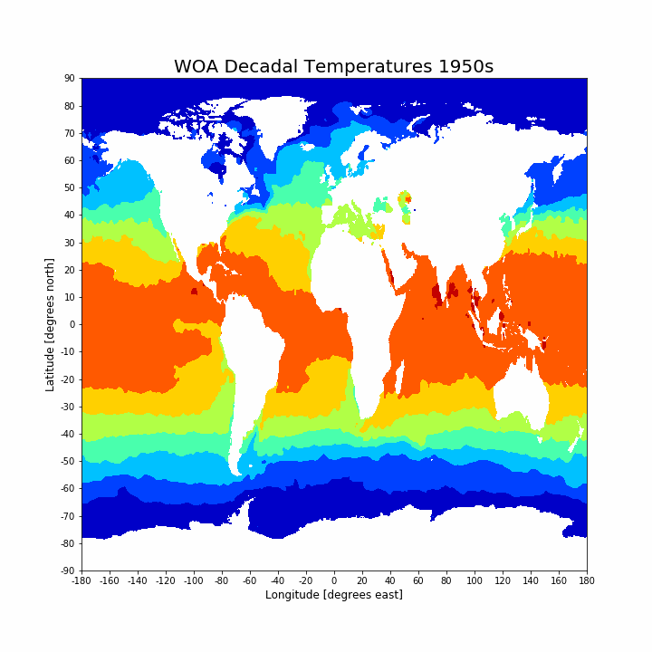

# Fun with Climate Data

Back in college I used to do oceanographic research and teach a couple of university courses on how to use Python and make cool images like this. Source: [World Ocean Atlas](https://www.nodc.noaa.gov/cgi-bin/OC5/woa18/woa18.pl?parameter=t). 

Checkout the notebook to see how to create this.

